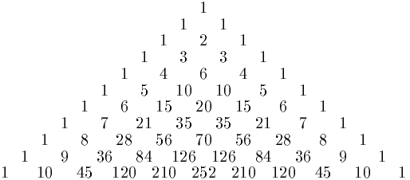

# Aufgaben 

1. Definiere eine zwei Funktionen, welche Temperaturen von Fahrenheit in Celius umwandeln und umgekehrt. 

        [°F] = [°C] × 9⁄5 + 32
        
        [°C] = ([°F] − 32) × 5⁄9

2. Schreibe eine Funktion `repeat(word, n)`, welche einen String so häufig wiederholt wie angegeben.

3. Schreibe eine Funktion, welche die n-te Fibonacci-Zahl berechnet. Die Reihe der Fibonaccizahlen hat die Eigenschaft, dass das die nächste Zahl immer die Summe der beiden Vorgänger ist.

        1, 1, 2, 3, 5, 8, 13, 21, 34, 55, ...

4. Schreibe eine Funktion `choose(n, k)`  , welche den Binomialkoeffizient `n` über `k` berechnet. Benutze dazu die Rekursionsvorschrift des Pascalschen Dreiecks. 
    

         
    

    
